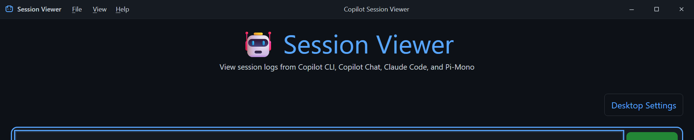

# Desktop Application

## Architecture and security boundaries

The desktop distribution is an isolated host for the same Vue and Express application used by npm/browser installations.

```text
Electron main
  ├─ versioned settings + rotating JSONL logs
  ├─ native file/folder dialogs + updater
  ├─ validated window/menu/dialog IPC
  ├─ Express on random 127.0.0.1 port
  │    └─ one-time request header → HttpOnly auth cookie + CSRF token
  └─ sandboxed BrowserWindow
       └─ preload allowlist → Vue renderer
```

The renderer has `contextIsolation`, sandboxing, and no Node integration. Navigation, popups, downloads, permissions, webviews, and arbitrary IPC are denied. External HTTP(S) links open in the system browser. Electron modules are never imported by Vue, Express, or the npm CLI entry point.

## Themed desktop shell

Electron rendering is detected only through `getDesktopBridge()`. Browser and npm/CLI routes keep their existing layout; the desktop wrapper is not mounted without the preload allowlist.

```text
src/client/components/desktop/
  DesktopShell.vue           runtime-gated layout integration
  DesktopTitleBar.vue        drag region, title, icon, menus
  DesktopMenuBar.vue         top-level keyboard/pointer controller
  DesktopContextMenu.vue     accessible menu overlay
  DesktopWindowControls.vue  minimize, maximize/restore, close
  DesktopDialogHost.vue      focus-trapped renderer dialogs
  dialogService.js           queued renderer dialog API
```

- Windows and Linux use a frameless `BrowserWindow` with native resize borders and a custom 35-pixel title bar.
- macOS uses `hiddenInset`, keeps native traffic lights, and reserves an inset region before the themed title content.
- All platforms use the application canvas color as the window background to avoid a white startup flash.
- The main process publishes focus, maximize, minimize, full-screen, and display-scale state. Snap, restore, double-click, display changes, and full-screen transitions therefore update the controls without renderer guesses.
- Only the title-bar background is draggable. Menus, buttons, and controls explicitly use `no-drag`.



Linux uses the same custom title bar and controls with platform-native resize and window-management behavior. macOS uses the same themed title region with the native traffic lights retained at the leading edge. Platform screenshots must be refreshed on their native operating system before a release that changes shell visuals.

## Window and menu IPC

The preload exposes individual methods, not `ipcRenderer`:

- `minimizeWindow()`
- `toggleMaximizeWindow()`
- `closeWindow()`
- `getWindowState()` / `isWindowMaximized()`
- `onWindowStateChanged()` / `onWindowMaximizedChanged()`
- `getMenuCommands()` / `executeMenuCommand()`
- renderer dialog readiness, request, and response methods

Every invoke verifies the exact application origin, owning `WebContents`, main frame, and a Zod argument schema. Main-to-renderer state and dialog payloads are validated again in preload. Window close uses the existing Electron lifecycle, including macOS close-without-quit behavior.

`electron/menuCommands.js` owns the declarative File, View, and Help model. The Vue menu and Electron application menu consume the same IDs and accelerators. The themed menu supports pointer input, F10/mnemonics, arrow keys, Home/End, Enter/Space, Escape, separators, disabled items, click-outside dismissal, and trigger-focus restoration. The Electron menu remains available for accelerators and macOS integration but is hidden as a visual menu on custom-frame platforms.

### Adding a menu command

1. Add the ID, label, target, and optional accelerator to `electron/menuCommands.js`.
2. Add its main-process behavior to `executeMenuCommand()` or handle its renderer event in `DesktopShell.vue`.
3. Add the ID to menu unit tests and cover user-visible behavior in Electron Playwright.

### Adding a window control

1. Add a dedicated channel and strict schema in `electron/ipc.js`.
2. Register a trusted-sender handler in `electron/main.js`.
3. Expose one narrow documented preload method.
4. Add the control to `DesktopWindowControls.vue` with an accessible name and `no-drag` behavior.

## Dialog host

All renderer `alert`, `confirm`, and `prompt` calls have been replaced by `dialogService.js`. Dialog descriptors contain only text, input metadata, and allowlisted button roles; HTML and callbacks cannot cross IPC. The host:

- traps Tab and Shift+Tab
- applies `aria-modal`, labelled titles, and descriptions
- blocks background interaction with `inert`
- supports Escape cancellation and Enter default activation
- restores the previously focused control
- queues dialogs so navigation does not silently discard input

Updater, about, and recoverable embedded-server dialogs use the renderer when its dialog host is healthy. Native message boxes are retained only for startup, renderer crash/unresponsiveness, fatal process failures, or renderer-dialog unavailability. File, folder, executable, diagnostics-save, and session-export pickers remain native operating-system dialogs.

### Adding a themed dialog

Use `showDialog()` or the typed convenience functions in `dialogService.js`. For main-process requests, pass a descriptor to `showApplicationDialog()` and compare the returned action ID. Never log the descriptor or returned text.

## Theme ownership and accessibility

`src/client/styles/desktop.css` owns semantic shell variables built from the existing dark palette. It defines active/inactive title bars, menus, window-control states, danger close states, dialog surfaces, overlays, focus outlines, disabled text, dimensions, and overlay layers.

Desktop brand artwork lives in `electron/assets`. Windows uses the multi-size `icon.ico` for the executable, installer, shortcuts, windows, and taskbar; macOS and Linux builds use `icon.png`.

The desktop window itself never scrolls. Routed client views scroll inside `.desktop-shell__content`, which owns the semantic desktop scrollbar colors and keeps the native Windows viewport scrollbar hidden.

On Windows, the taskbar Jump List includes **Add Local Session Folder**. It activates the existing app instance, opens the native directory picker, and routes the selected folder through the same validated registration flow as **File → Add Session Directory**.

Right-clicking selected text or an editable field opens a native edit menu. Read-only selections support copying; inputs add undo, redo, cut, paste, and select-all according to Chromium's edit state. Password selections are never exposed to copy or cut actions.

To add a token, declare a semantic `--desktop-*` variable in `:root`, consume it only in desktop component styles, and add it to `desktopTheme.test.js`. Do not add desktop offsets to browser route components.

All interactive shell elements require an accessible name and visible keyboard focus. Menus use `menu`, `menuitem`, and `separator` roles. Dialogs use `dialog` or `alertdialog`, labelled title/description relationships, and deterministic focus restoration.

## Desktop settings

Open **File → Desktop Settings** to navigate to the dedicated settings view and:

- select stable or prerelease updates
- choose absolute `copilot`, `claude`, and `pi` executable paths
- open logs or export a sanitized diagnostic ZIP

Executable-path changes take effect after restart. The inherited `PATH` is used after configured paths; macOS also checks common Homebrew and user-local binary directories. Commands are spawned directly without a shell.

Registered directories and known-tag indexes are isolated in Electron user data. Session files and per-session tags remain in their original source directories.

## Settings and logs

Typical locations:

| Platform | Settings | Logs |
| --- | --- | --- |
| Windows | `%APPDATA%\Copilot Session Viewer\settings.json` | `%APPDATA%\Copilot Session Viewer\logs` |
| macOS | `~/Library/Application Support/Copilot Session Viewer/settings.json` | `~/Library/Logs/Copilot Session Viewer` |
| Linux | `~/.config/Copilot Session Viewer/settings.json` | Electron's application log directory |

Settings use a migrated versioned schema. Corrupt settings are copied to a timestamped `.corrupt-*` backup before defaults are restored.

Desktop JSONL logs rotate at 5 MiB with seven retained files. They include timestamp, severity, component, application version, platform, event, duration, status, and correlation identifiers. Authentication data, cookies, tokens, prompts, event/session contents, session identifiers, dialog text, user input, and file paths are redacted. Diagnostic exports add application/platform metadata but no session data.

Local shell events include initialization, focus changes, minimize/maximize/restore, close requests, allowlisted menu command IDs, dialog type/source, and dialog result action. They never include menu state, dialog content, input values, sessions, or paths. The application contains no telemetry or analytics integration; logs and diagnostic exports remain on the local machine unless the user explicitly exports them.

## Updates and packages

- Windows x64: per-user NSIS; uninstall preserves settings/logs
- macOS: separate x64 and arm64 DMG and ZIP artifacts
- Linux x64: AppImage

Stable users receive `latest`; prerelease users receive `beta`. Checks run after startup without blocking the window. Downloads and restart/install both require confirmation; choosing **Later** never installs on normal exit. Downgrades are disabled. Updates are enabled only when the package contains the production-release marker written by the signed release workflow. Unsigned development, CI, and nightly packages remain update-disabled.

Every release should include updater metadata, platform `SHA256SUMS-*` files, third-party license data, and a CycloneDX SBOM. Signing/notarization credentials are provided only through GitHub Actions secrets.

## Development

```bash
npm run electron:dev          # build and launch source host with fixtures
npm run test:electron         # isolated Jest tests
npm run test:electron:e2e     # Playwright Electron tests with fixtures
npm run electron:unpacked     # unpacked package for the current platform
npm run electron:smoke        # launch packaged output and verify initial window
npm run electron:dist:win
npm run electron:dist:msi
npm run electron:dist:mac
npm run electron:dist:linux
```

The MSI command allows WiX warnings because ICE validation can be blocked by Windows system policy for non-elevated processes (`LGHT1105`). It does not disable MSI creation or affect the signed NSIS release workflow. Use an unrestricted build host if MSI ICE validation is required for release compliance.

Electron test runs use synthetic fixtures and isolated user data. Browser Playwright tests remain independent and do not require Electron globals.

Relevant coverage includes window configuration, IPC sender/schema checks, logging redaction, semantic tokens, shared menus, renderer-dialog coordination, title-bar controls, double-click maximize, keyboard/pointer menus, focus restoration, native pickers, and browser fallback.

## Troubleshooting

- **macOS cannot find a CLI:** select its executable in Desktop Settings. GUI applications often have a smaller PATH than Terminal.
- **Unsigned-build warning:** verify the release checksum and release notes. Public production builds should be signed/notarized when credentials are configured.
- **AppImage does not start:** run `chmod +x` on it. Desktop integration and delta updates vary by distribution.
- **No sessions:** add a source directory with the native directory picker or verify the source's default path.
- **Server/renderer recovery screen:** restart the application and export diagnostics. The host attempts one safe server restart and offers renderer reload/quit recovery.
- **Offline startup:** the viewer remains usable; update failures are logged and never block startup.
- **Title bar does not drag:** inspect the target in DevTools. Interactive descendants require `-webkit-app-region: no-drag`; only non-interactive title-bar background should be `drag`.
- **Controls do not match window state:** verify `desktop:window-state-changed` is received after snap/maximize/restore and that the event came from the owning main frame.
- **Menus lose focus:** close overlays through the menu controller rather than removing them directly so the saved trigger can be restored.
- **Dialog is behind or inaccessible:** keep the host teleported to `body`, preserve the desktop dialog z-index, and ensure `#app` is made inert only while the teleported dialog is active.
- **Scaling or display move looks wrong:** state is expressed in Electron CSS pixels. Do not multiply dimensions by `scaleFactor`; use it only for diagnostics or scale-aware assets.
- **macOS title overlap:** keep `hiddenInset`, the traffic-light position, and the renderer traffic-light spacer synchronized.
